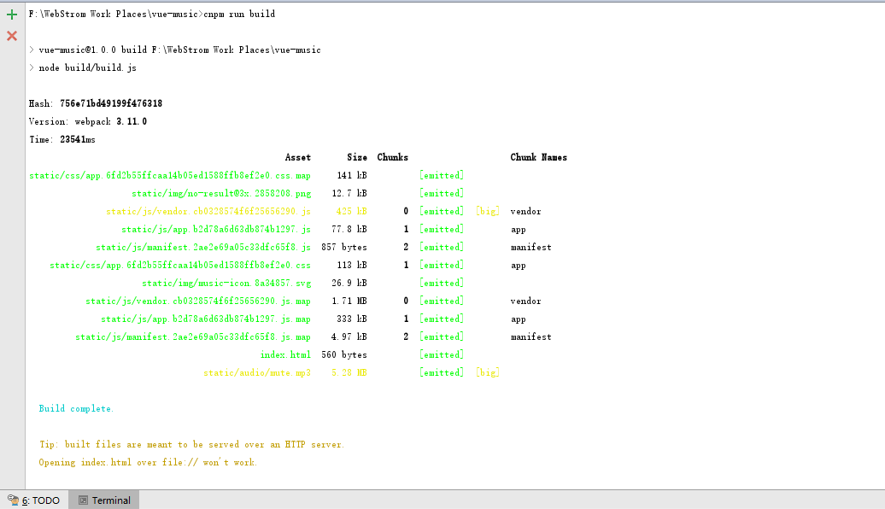
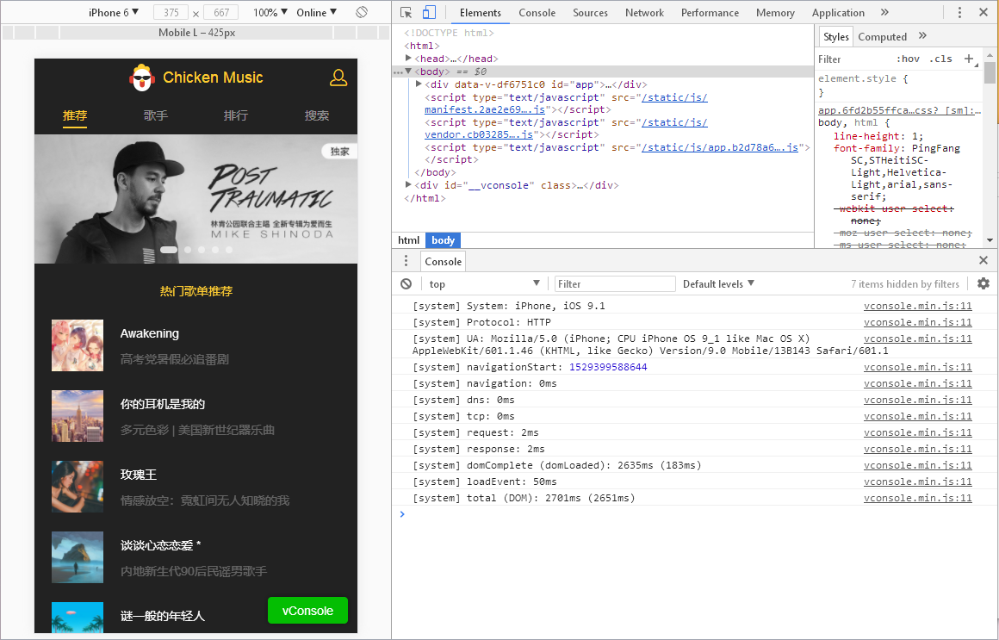
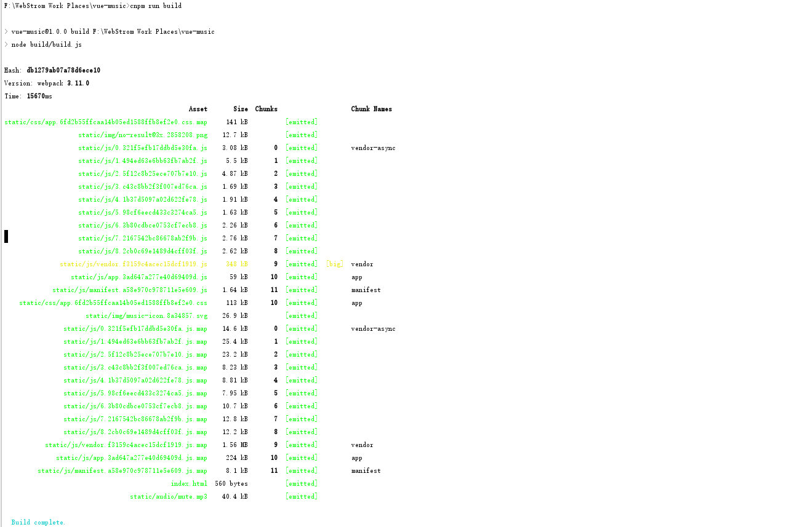

# Package Project
> 打包项目配置记录
## Build Setup

``` bash
Step.1# 运行下面指令进行编译
npm run build
```

``` bash
Step.2# 编写模拟node服务 prod.server.js 并运行
note.1 # config/index.js build下添加模拟端口号
 port: 9000
note.2 # 运行模拟服务器
 node prod.server.js 
```

      

```bash
Step.3# 配置路由懒加载，重新编译
npm run build
```

