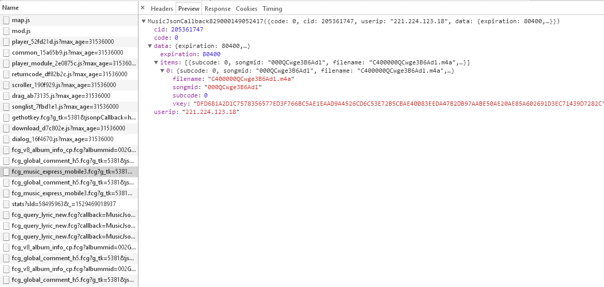
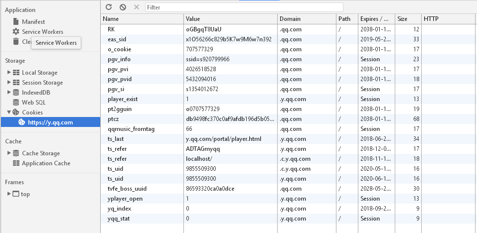
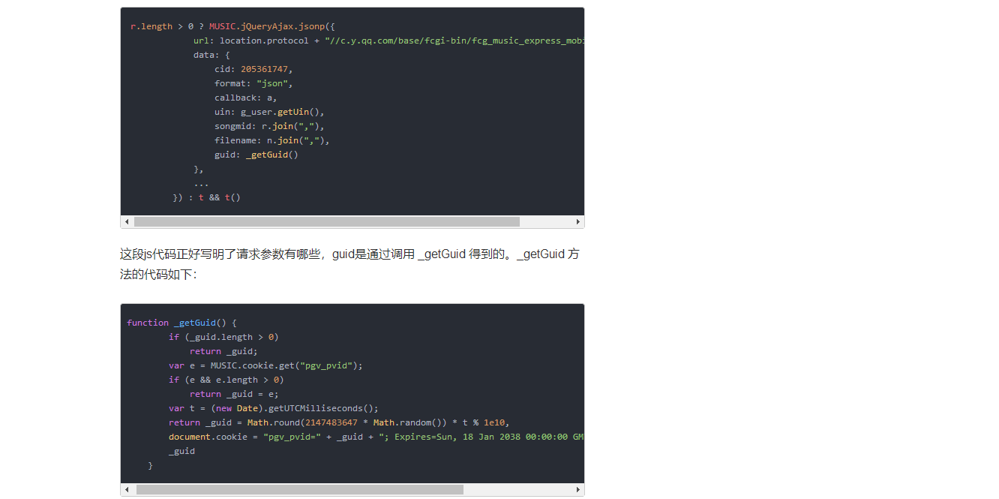
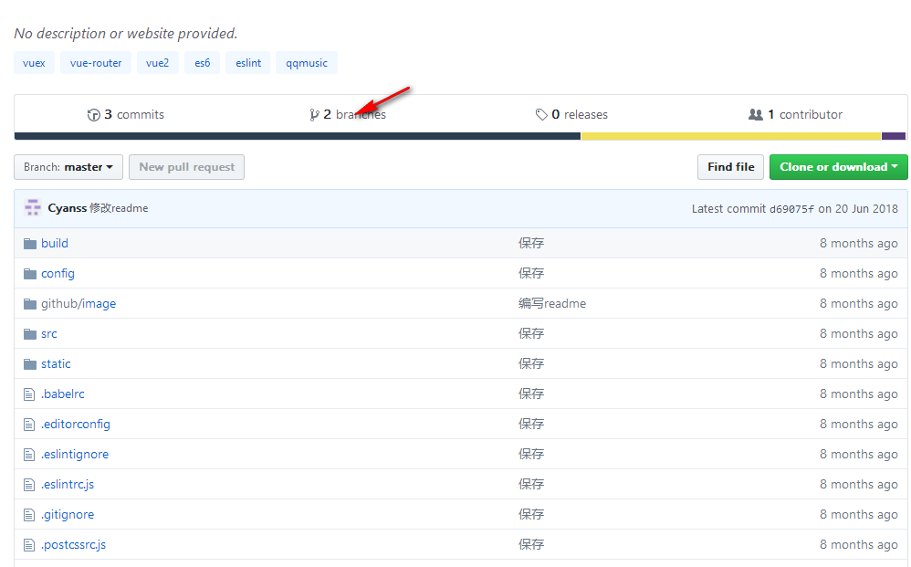
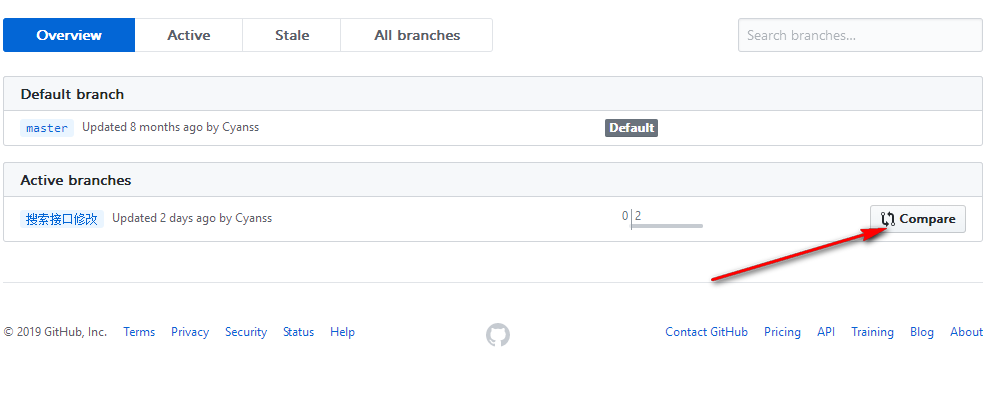

# vue-music

&emsp;&emsp;基于黄奕老师的移动端WebApp课程开发的音乐播放器，仅供学习交流，请参考黄奕老师源码。


## Differences 

### 1、关于QQ音乐数据抓取
&emsp;&emsp;与课程中的抓取方式少许不同，查看QQ音乐音频文件的请求可以知道，每一首歌曲都需要经过两个请求才能访问到Nginx服务器

```bash
# 第一个请求获取vKey

url: https://c.y.qq.com/base/fcgi-bin/fcg_music_express_mobile3.fcg
params:
  g_tk: 5381
  cid: 205361747
  songmid: 000QCwge3B6Ad1
  filename: C400000QCwge3B6Ad1.m4a
  guid: 5432094016
  ...
```


#### 其中重要的几个参数：   
&emsp;&emsp;g_tk：全局固定值，推测是服务器用来区分不同业务范围的请求  
&emsp;&emsp;cid：固定值，推测为客户端编号，用来区分不同平台的请求   
&emsp;&emsp;songmid：歌曲编号   
&emsp;&emsp;filename：文件名称 C400 + songmid + .m4a，其中C400推测用来标识音质参数   
&emsp;&emsp;guid：获取vKey的钥匙，查询客户端的cookie信息可以知道，这个数值保存在pgv_pvid中，但是cookie中的信息我们无法获取到，查看jS文件可以发现，guid的值为一个随机产生的数值。
  

#### guid分析参考 [QQ音乐的歌曲真实地址解析](https://www.jianshu.com/p/b26c0c9c6149)



```bash
# 第二个请求获取音频文件
url: http://dl.stream.qqmusic.qq.com/C400000QCwge3B6Ad1.m4a
params:
  vkey: ED418C2AEECDAE201F65C1069426903ED556141B51FE85FEC1D2B93845420BA4E9691C07E1D5F8D274BDD5A7EDF1D4AD8709C32A4785EB14
  guid:5432094016
  fromtag:66
  ...
```
### 2、关于移动端无法自动播放，以及切换歌曲后歌曲声音延迟问题
#### 无法自动播放问题：    
&emsp;&emsp;原因在与移动端，无论是微信、QQ或者其他浏览器为了避免手机资源的消耗都同时禁用了Html5.0中Audio/video自动播放的功能，所有的自动播放功能都需要用户手动触发。

#### 解决方法：   
&emsp;&emsp;开始时刻让播放器暂停，让用户手动触发一次播放

#### 切换歌曲后歌曲声音延迟问题:    
&emsp;&emsp;原因在于在获取音频文件的工程中是异步的，并且通过两个请求才能获取到音频文件，在切换歌曲时，由于下个歌曲的音频文件Audio还未获取或者说准备就绪，Audio将会继续播放当前音频。   
&emsp;&emsp;而且后期在调试过程中为了防止用户快速切换歌曲造成服务器压力，在歌曲获取时添加了延时执行。这使得歌曲切换过程中会有一段相当长的空白时间。   
&emsp;&emsp;由于Vue里使用了Watch来监听音频文件的url的变化（由于首先需要获取vkey,将vkey组合成歌曲音频文件的URL），当歌曲url变化时Audio开始播放，即使在切换歌曲时先将Audio暂停播放，并不能解决问题
#### 解决方法:    
&emsp;&emsp;预加载一段空白音频mute.mp3，当歌曲音频文件准备就绪时，开始播放歌曲


### 3、关于IOS下 animation-play-state动画属性 play pause无效
&emsp;&emsp;原因应该是IOS系统的兼容问题，具体内容不清楚

#### 解决方法:    
&emsp;&emsp;使用tranform 属性手动进行状态叠加
参考[ios下 animation-play-state不起作用](https://codepen.io/HaoyCn/pen/BZZrLd)  
&emsp;&emsp;在编写过程中会发现transform属性利用cocat函数进行叠加的时候，在微信中发现无效，原因在于微信里transform的默认属性不再是none,而是martix(1,0,0,1,0,0)的字符串,而且浏览器也无法识别transform：martix(1,0,0,1,0,0) martix(1,0,0,1,0,0)形式的属性，因此问我们需要手动将两个Martix矩阵进行叠加。   
&emsp;&emsp;参考[理解CSS3 transform中的Matrix(矩阵)](https://www.zhangxinxu.com/wordpress/2012/06/css3-transform-matrix-%E7%9F%A9%E9%98%B5/)，编写Martix矩阵转换方法：common/js/dom

```
export class Matrix {
  constructor(matrix) {
    ...
  }

  /**
   * 矩阵字符串解析
   * @param matrix
   * @returns {Array}
   * @private
   */
  _prefixMatrix(matrix) {
    ...
  }

  /**
   * 矩阵叠加方法
   * @param matrix 叠加的矩阵
   * @returns {Matrix} Matrix对象
   */
  superposeMatrix(matrix) {
   ...
  }

  /**
   * toString方法
   * @returns {string}
   */
  toMatrixString() {
    ...
  }

  /**
   * 旋转
   * @param angle 旋转角度
   * @returns {Matrix} Matrix对象
   */
  rotateMatrix(angle) {
    ...
  }

  /**
   * 平移
   * @param x X轴平移距离
   * @param y Y轴平移距离
   * @returns {Matrix} Matrix对象
   */
  translationMatrix(x = 0, y = 0) {
    ...
  }

  /**
   * 缩放
   * @param ratio 比例值
   * @returns {Matrix} Matrix对象
   */
  scaleMatrix(ratio) {
    ...
  }

  /**
   * 拉伸
   * @param angleX X轴拉伸角度
   * @param angleY Y轴拉伸角度
   * @returns {*} Matrix对象
   */
  skewMatrix(angleX = 0, angleY = 0) {
    ...
  }

  /**
   * 镜像
   * @param angle 镜像轴角度
   * @returns {Matrix} Matrix对象
   */
  image(angle) {
     ...
  }
}
```


## Build Setup

``` bash
# 安装依赖
npm install

# 运行开发环境
npm run dev

# 打包编译
npm run build

# 运行模拟服务器
node prod.server.js
```
#### 后续BUG修复: 
&emsp;&emsp;搜索页面中发现以前的歌曲搜索接口被屏蔽掉了，以及部分歌曲无法获取音频文件播放的Bug,笔者尝试更换了相关接口，以及音频无法播放的相关文件，只是经过了简单测试，目前未发现新的问题，但是由于相关优化还未做完，以及Webpack-service组件低版本中存在的安全漏洞问题没有找到合适的解决方案，修复后的代码上传到了分支里，需要的朋友可以通过以下方式产看更改的文件

1、点击[branches](https://github.com/Cyanss/vue-music/branches)

2、点击[Compore](https://github.com/Cyanss/vue-music/compare/%E6%90%9C%E7%B4%A2%E6%8E%A5%E5%8F%A3%E4%BF%AE%E6%94%B9)


[模拟服务器](PACKAGE_CONFIG.md)  
[vuex](https://vuex.vuejs.org)  
[fastclick](https://github.com/ftlabs/fastclick)  
[jsonp](https://github.com/webmodules/jsonp)  
[better-scroll](https://github.com/ustbhuangyi/better-scroll)  
[axios](https://www.kancloud.cn/yunye/axios/234845)  
[vue-lazyload](https://www.npmjs.com/package/vue-lazyload)   
[create-keyframe-animation](https://www.npmjs.com/package/create-keyframe-animation)  
[js-base64](https://www.npmjs.com/package/base64-js)  
[lyric-parser](https://github.com/ustbhuangyi/lyric-parser)  
[good-storage](https://github.com/ustbhuangyi/storage)

